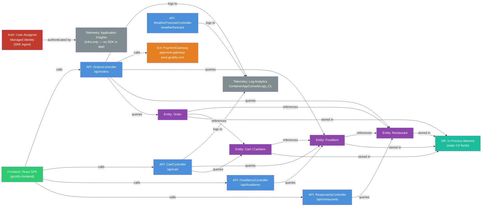

# Application Ontology — Grubify

> Generated by the `app-ontology` skill (static analysis only — no running app required).
> Source: `demos/GrubifyIncidentLab/src/grubify`
> Languages: .NET 9 (ASP.NET Core Web API) + React/TypeScript (SPA frontend)

---

## Summary

| Component type | Count |
|---|---|
| frontend | 1 |
| api | 5 |
| entity | 4 |
| database | 1 |
| external-service | 1 |
| telemetry | 2 |
| auth | 1 |

**Total nodes:** 15 | **Total edges:** 29

---

## Dependency Graph (Mermaid)



---

## Node Inventory

| ID | Type | Name | File | Notes |
|---|---|---|---|---|
| `frontend__React` | frontend | React SPA | `grubify-frontend/src/` | React 19 + MUI + axios; served via nginx on Container App (port 80) |
| `api__Cart` | api | CartController | `GrubifyApi/Controllers/CartController.cs` | GET/POST/PUT/DELETE `/api/cart/{userId}[/items/{itemId}]`; **memory leak** in `POST /items` |
| `api__FoodItems` | api | FoodItemsController | `GrubifyApi/Controllers/FoodItemsController.cs` | GET `/api/fooditems[/{id}]`, `/restaurant/{id}`, `/category/{c}`, `/search`, `/dietary` |
| `api__Orders` | api | OrdersController | `GrubifyApi/Controllers/OrdersController.cs` | POST/GET `/api/orders`; v1/v2 payment-gateway fault mode via `API_VERSION` env var |
| `api__Restaurants` | api | RestaurantsController | `GrubifyApi/Controllers/RestaurantsController.cs` | GET `/api/restaurants[/{id}]`, `/cuisine/{type}`, `/search` |
| `api__WeatherForecast` | api | WeatherForecastController | `GrubifyApi/Controllers/WeatherForecastController.cs` | GET `/weatherforecast`; test/scaffold endpoint only |
| `entity__Cart` | entity | Cart / CartItem | `GrubifyApi/Models/Cart.cs` | Held in `CartController.UserCarts` (static `Dictionary<string,Cart>`); never evicted; 10 MB buffer added per POST |
| `entity__FoodItem` | entity | FoodItem | `GrubifyApi/Models/FoodItem.cs` | Static list in `FoodItemsController.FoodItems`; fields: Id, Name, Price, Category, RestaurantId, etc. |
| `entity__Order` | entity | Order | `GrubifyApi/Models/Order.cs` | Static list in `OrdersController.Orders`; status enum: Placed→Delivered/Cancelled |
| `entity__Restaurant` | entity | Restaurant | `GrubifyApi/Models/Restaurant.cs` | Static list in `RestaurantsController.Restaurants`; fields: Id, Name, CuisineType, Rating, etc. |
| `database__InMemory` | database | In-Process Memory | `GrubifyApi/Controllers/*.cs` | All data is held in static C# fields; no external DB; **lost on restart** |
| `external_service__PaymentGateway` | external-service | PaymentGateway | `GrubifyApi/Controllers/OrdersController.cs` | Simulated; v1 calls `payment-gateway-prod.grubify.com`; v2 calls wrong staging URL → 500 |
| `telemetry__LogAnalytics` | telemetry | Log Analytics Workspace | `infrastructure/modules/monitoring.bicep` | Container App env forwards stdout→`ContainerAppConsoleLogs_CL`; sole log sink for the app |
| `telemetry__ApplicationInsights` | telemetry | Application Insights | `infrastructure/modules/monitoring.bicep` | Provisioned and linked to Log Analytics; used by SRE Agent; **no App Insights SDK in the .NET app** |
| `auth__ManagedIdentity` | auth | User-Assigned Managed Identity | `infrastructure/modules/identity.bicep` | Assigned to SRE Agent only; scoped to resource group (Monitoring Reader, Log Analytics Reader) |

---

## Edge Inventory

| Source | Relationship | Target | Evidence |
|---|---|---|---|
| `frontend__React` | calls | `api__Restaurants` | `grubify-frontend/src/services/api.ts` — `restaurantService.getAll/getById/getByCuisine/search` via axios |
| `frontend__React` | calls | `api__FoodItems` | `grubify-frontend/src/services/api.ts` — `foodItemService.*` |
| `frontend__React` | calls | `api__Cart` | `grubify-frontend/src/services/api.ts` — `cartService.*` |
| `frontend__React` | calls | `api__Orders` | `grubify-frontend/src/services/api.ts` — `orderService.place` |
| `api__Cart` | queries | `entity__Cart` | `CartController.UserCarts` (static `Dictionary<string,Cart>`) |
| `api__Cart` | queries | `entity__FoodItem` | `CartController.GetFoodItemById()` called when adding items |
| `api__FoodItems` | queries | `entity__FoodItem` | `FoodItemsController.FoodItems` static list |
| `api__Orders` | queries | `entity__Order` | `OrdersController.Orders` static list |
| `api__Orders` | queries | `entity__Restaurant` | `OrdersController` resolves restaurant for new order |
| `api__Orders` | queries | `entity__FoodItem` | `OrdersController` reads food items during order placement |
| `api__Restaurants` | queries | `entity__Restaurant` | `RestaurantsController.Restaurants` static list |
| `api__Orders` | calls | `external_service__PaymentGateway` | `OrdersController.ProcessPayment()` — simulated call; v2 always returns failure |
| `entity__Cart` | stored in | `database__InMemory` | `CartController.UserCarts` — static `Dictionary<string,Cart>`, no DB |
| `entity__FoodItem` | stored in | `database__InMemory` | `FoodItemsController.FoodItems` — hardcoded static `List<FoodItem>` |
| `entity__Order` | stored in | `database__InMemory` | `OrdersController.Orders` — static `List<Order>`, lost on restart |
| `entity__Restaurant` | stored in | `database__InMemory` | `RestaurantsController.Restaurants` — hardcoded static `List<Restaurant>` |
| `entity__Cart` | references | `entity__FoodItem` | `CartItem.FoodItem` property |
| `entity__Order` | references | `entity__Cart` | `Order.Items` is `List<CartItem>` |
| `entity__Order` | references | `entity__Restaurant` | `Order.Restaurant` property |
| `entity__FoodItem` | references | `entity__Restaurant` | `FoodItem.RestaurantId` FK |
| `api__Cart` | logs to | `telemetry__LogAnalytics` | `Console.WriteLine` in `POST /items` → container stdout → `ContainerAppConsoleLogs_CL` |
| `api__Orders` | logs to | `telemetry__LogAnalytics` | `Console.WriteLine` on every payment attempt → `ContainerAppConsoleLogs_CL` |
| `api__WeatherForecast` | logs to | `telemetry__LogAnalytics` | `ILogger<WeatherForecastController>` → `ContainerAppConsoleLogs_CL` |
| `auth__ManagedIdentity` | authenticated by | `telemetry__ApplicationInsights` | SRE Agent identity is granted Monitoring Reader on App Insights resource |

---

## Machine-Readable Graph (JSON)

```json
{
  "nodes": [
    {"id": "frontend__React",              "type": "frontend",          "name": "React SPA",             "file": "grubify-frontend/src/"},
    {"id": "api__Cart",                    "type": "api",               "name": "CartController",        "file": "GrubifyApi/Controllers/CartController.cs"},
    {"id": "api__FoodItems",               "type": "api",               "name": "FoodItemsController",   "file": "GrubifyApi/Controllers/FoodItemsController.cs"},
    {"id": "api__Orders",                  "type": "api",               "name": "OrdersController",      "file": "GrubifyApi/Controllers/OrdersController.cs"},
    {"id": "api__Restaurants",             "type": "api",               "name": "RestaurantsController", "file": "GrubifyApi/Controllers/RestaurantsController.cs"},
    {"id": "api__WeatherForecast",         "type": "api",               "name": "WeatherForecastController", "file": "GrubifyApi/Controllers/WeatherForecastController.cs"},
    {"id": "entity__Cart",                 "type": "entity",            "name": "Cart / CartItem",       "file": "GrubifyApi/Models/Cart.cs"},
    {"id": "entity__FoodItem",             "type": "entity",            "name": "FoodItem",              "file": "GrubifyApi/Models/FoodItem.cs"},
    {"id": "entity__Order",                "type": "entity",            "name": "Order",                 "file": "GrubifyApi/Models/Order.cs"},
    {"id": "entity__Restaurant",           "type": "entity",            "name": "Restaurant",            "file": "GrubifyApi/Models/Restaurant.cs"},
    {"id": "database__InMemory",           "type": "database",          "name": "In-Process Memory",     "file": "GrubifyApi/Controllers/*.cs"},
    {"id": "external_service__PaymentGateway", "type": "external-service", "name": "PaymentGateway",    "file": "GrubifyApi/Controllers/OrdersController.cs"},
    {"id": "telemetry__LogAnalytics",      "type": "telemetry",         "name": "Log Analytics",         "file": "infrastructure/modules/monitoring.bicep"},
    {"id": "telemetry__ApplicationInsights","type": "telemetry",        "name": "Application Insights",  "file": "infrastructure/modules/monitoring.bicep"},
    {"id": "auth__ManagedIdentity",        "type": "auth",              "name": "User-Assigned Managed Identity", "file": "infrastructure/modules/identity.bicep"}
  ],
  "edges": [
    {"source": "frontend__React",          "relationship": "calls",      "target": "api__Restaurants"},
    {"source": "frontend__React",          "relationship": "calls",      "target": "api__FoodItems"},
    {"source": "frontend__React",          "relationship": "calls",      "target": "api__Cart"},
    {"source": "frontend__React",          "relationship": "calls",      "target": "api__Orders"},
    {"source": "api__Cart",                "relationship": "queries",    "target": "entity__Cart"},
    {"source": "api__Cart",                "relationship": "queries",    "target": "entity__FoodItem"},
    {"source": "api__FoodItems",           "relationship": "queries",    "target": "entity__FoodItem"},
    {"source": "api__Orders",              "relationship": "queries",    "target": "entity__Order"},
    {"source": "api__Orders",              "relationship": "queries",    "target": "entity__Restaurant"},
    {"source": "api__Orders",              "relationship": "queries",    "target": "entity__FoodItem"},
    {"source": "api__Restaurants",         "relationship": "queries",    "target": "entity__Restaurant"},
    {"source": "api__Orders",              "relationship": "calls",      "target": "external_service__PaymentGateway"},
    {"source": "entity__Cart",             "relationship": "stored in",  "target": "database__InMemory"},
    {"source": "entity__FoodItem",         "relationship": "stored in",  "target": "database__InMemory"},
    {"source": "entity__Order",            "relationship": "stored in",  "target": "database__InMemory"},
    {"source": "entity__Restaurant",       "relationship": "stored in",  "target": "database__InMemory"},
    {"source": "entity__Cart",             "relationship": "references", "target": "entity__FoodItem"},
    {"source": "entity__Order",            "relationship": "references", "target": "entity__Cart"},
    {"source": "entity__Order",            "relationship": "references", "target": "entity__Restaurant"},
    {"source": "entity__FoodItem",         "relationship": "references", "target": "entity__Restaurant"},
    {"source": "api__Cart",                "relationship": "logs to",    "target": "telemetry__LogAnalytics"},
    {"source": "api__Orders",              "relationship": "logs to",    "target": "telemetry__LogAnalytics"},
    {"source": "api__WeatherForecast",     "relationship": "logs to",    "target": "telemetry__LogAnalytics"},
    {"source": "auth__ManagedIdentity",    "relationship": "authenticated by", "target": "telemetry__ApplicationInsights"}
  ]
}
```

---

## Fault Injection Map

These are the built-in fault modes used in the SRE Agent demo. Document them here so the agent knowledge base reflects the intentional failure paths.

| Fault | Trigger | Symptom |
|---|---|---|
| **Memory leak** | Rapid `POST /api/cart/{userId}/items` calls | Each call allocates a 10 MB `byte[]` into `RequestDataCache` (never freed); container OOM kill → restart → HTTP 503 |
| **Payment failure (v2)** | Set `API_VERSION=v2` env var on the Container App | `POST /api/orders` always returns `HTTP 500 PAYMENT_ERROR`; gateway URL points to non-existent staging host |
| **Data loss on restart** | Any container restart (OOM or manual) | All in-memory carts and orders are lost; clients see empty state |

---

## Metrics

**No metrics SDK is configured in the .NET app.** `Program.cs` does not call `AddOpenTelemetry()`, `AddApplicationInsights()`, or any custom meter registration.

Available metrics come exclusively from the **Azure Monitor Container Apps platform**:

| Instrument | Type | Source | SRE relevance |
|---|---|---|---|
| `Requests` (azure.containerapp) | Counter (5xx/2xx dimension) | Azure Monitor — Container App metric | **Primary alert trigger**: alert fires when `Requests{statusCodeCategory=5xx} > 5` in 5 min window |
| `WorkingMemoryBytes` / `CpuUsage` | Gauge | Azure Monitor — Container App metric | Correlates with OOM fault; memory grows continuously during cart-leak scenario |
| Container restart count | Counter | Azure Monitor — Container App | Increments when OOM kill triggers restart |

> **Observability gap**: The app emits zero custom metrics. Request rate, cart item count, payment failure rate, and order volume are not measurable without platform-level proxies.

---

## Traces

**No distributed tracing is configured.** The app ships no OpenTelemetry SDK, no `Activity` instrumentation, and `Program.cs` does not call `builder.Services.AddOpenTelemetry()`.

No entries were found in `/tmp/ontology-scan/traces.tsv`.

| Endpoint | Auto-instrumentation | Manual `Activity.AddException`? | Manual `Activity.SetStatus(Error)`? | Notes |
|---|---|---|---|---|
| `POST /api/cart/{userId}/items` | None | No | No | Memory leak path is silent in traces |
| `POST /api/orders` | None | No | No | Payment failure returns HTTP 500 but no span captures it |
| `GET /api/restaurants` | None | No | No | — |
| `GET /api/fooditems` | None | No | No | — |
| `GET /weatherforecast` | None (ILogger only) | No | No | — |
| Frontend (React) | None | No | No | No RUM / browser SDK; purely `console.log` |

> **Observability gap**: No end-to-end traces available. The SRE Agent must rely on `ContainerAppConsoleLogs_CL` (console output) and Azure Monitor metric alerts to diagnose incidents.

---

## Logging Granularity

Log routing: container stdout/stderr → Container App Environment → **Log Analytics** table `ContainerAppConsoleLogs_CL` (field: `Log_s`). No structured logging; all statements are plain-text `Console.WriteLine`.

| Endpoint | Condition | Level | Message template | Structured fields |
|---|---|---|---|---|
| `POST /api/cart/{userId}/items` | Every call | `Console` (stdout) | `"Analytics cache: Added request data. Total entries: {count}"` | None |
| `POST /api/cart/{userId}/items` | Every call | `Console` (stdout) | `"Cache size: {count*10}MB"` | None |
| `POST /api/orders` | Constructor | `Console` (stdout) | `"OrdersController initialized with version: {version}"` | API_VERSION env var |
| `POST /api/orders` | v2 path, before payment | `Console` (stdout) | `"V2: Attempting payment processing with gateway: {url}"` | Gateway URL |
| `POST /api/orders` | v1 path, before payment | `Console` (stdout) | `"V1: Processing payment successfully with gateway: {url}"` | Gateway URL |
| `POST /api/orders` | Every call | `Console` (stdout) | `"PlaceOrder called - Version: {v1|v2}"` | Version string |
| `POST /api/orders` | Payment failure (v2) | `Console` (stdout) | `"Payment processing failed in v2: {errorMessage}"` | Error message |
| `POST /api/orders` | Payment success (v1) | `Console` (stdout) | `"Payment successful in v1 - creating order"` | None |
| `GET /weatherforecast` | Every call | `ILogger.Information` (framework) | Framework-generated request log | Request duration, status |
| All endpoints | Every request | ASP.NET Core framework | HTTP access logs via middleware | Method, path, status, duration |

**Endpoints with zero application-level log statements:**
- `GET /api/restaurants`, `GET /api/restaurants/{id}`, `/cuisine/*`, `/search`
- `GET /api/fooditems`, `GET /api/fooditems/{id}`, `/restaurant/*`, `/category/*`, `/search`, `/dietary`
- `GET /api/cart/{userId}`
- `PUT /api/cart/{userId}/items/{itemId}`, `DELETE /api/cart/{userId}/items/{itemId}`, `DELETE /api/cart/{userId}`
- `GET /api/orders/*` (all read endpoints)

> **Observability gap**: Most read endpoints emit no application-level log statements. During a memory-pressure incident, only `POST /api/cart/{userId}/items` logs are available to correlate with growing memory. The log message `"Cache size: {N}MB"` is the only in-app indicator of the leak growing.
